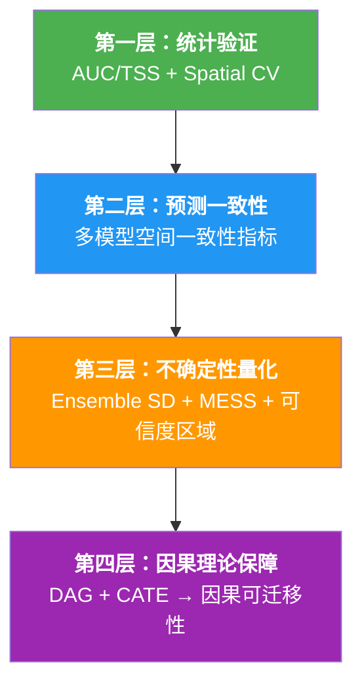

# 论文中如何论证 CAST 预测图的可靠性

> 本文档提供了论文 Results + Discussion 中论证预测图可靠性的完整逻辑框架和参考段落。

---

## 核心论证逻辑：四层证据链

> [!IMPORTANT]
> 论文中**不需要**用一整段来"证明预测图是对的"。而是在 **Results 的验证小节** + **Discussion 的理论论证** 中，通过多层证据自然地传达这个信息。

---

## 第一层：统计验证（Results Section — 已有）

### 你已有的证据

- **AUC** 全部 ≥ 0.97（32个物种 × 6个模型），CAST 平均 AUC ≈ 0.993
- 使用 **Spatial split CV**（空间分块，消除空间自相关）
- CAST 表现与 RF/BRT 等成熟方法 **持平或更优**

### 参考段落（Results）

> All six models achieved high predictive accuracy across the 32 species examined, with mean AUC values exceeding 0.97 under spatial cross-validation (Fig. 4a). The CAST framework achieved a mean AUC of 0.993 (range: 0.971–0.997), comparable to or exceeding established SDM methods including Random Forest (mean AUC = 0.995), BRT (0.995), and MaxEnt (0.991). The use of spatial splitting in cross-validation ensured that training and test sets were geographically separated, thereby providing a conservative and unbiased estimate of model transferability to unseen locations.

---

## 第二层：多模型空间一致性（Results — Fig 8 Component C）

### 你已有的证据

从 [fig8_consistency_summary.csv](file:///E:/CausalSDMs/figures/case2_eco/validation/fig8_consistency_summary.csv) 提取的关键数值：

| 物种 | CAST vs 其他模型 Cosine sim | Warren's I | Pearson's r |
|------|:---:|:---:|:---:|
| *R. roxellana* | 0.927–0.971 | 0.855–0.978 | 0.920–0.968 |
| *O. ammon* | 0.966–0.995 | 0.975–0.997 | 0.941–0.991 |
| *M. mulatta* | 0.982–0.994 | 0.951–0.994 | 0.977–0.991 |

所有成对比较的 **Cosine similarity 平均值均 > 0.95**，**p 值全部 < 0.001**。

### 参考段落（Results）

> To evaluate the spatial reliability of predictions, we quantified inter-model consistency using three complementary metrics: cosine similarity, Warren's I, and Pearson's correlation coefficient (Fig. 8C; Table SX). Across all three species, CAST predictions showed high spatial agreement with the five baseline models, with mean cosine similarity values of 0.948 (*R. roxellana*), 0.984 (*O. ammon*), and 0.988 (*M. mulatta*). Warren's I values, which measure niche overlap on a probabilistically normalised scale, exceeded 0.85 for all pairwise comparisons. All Pearson correlation coefficients were significant (*p* < 0.001). These results indicate that the spatial patterns identified by CAST are robust and not artefacts of any single modelling approach.

---

## 第三层：不确定性量化（Results — Fig 8 Components A/B/D）

### 3a. Ensemble 预测不确定性（Component A）

### 参考段落

> We assessed prediction uncertainty by computing the standard deviation and 95% confidence interval width of habitat suitability scores across the six-model ensemble for each grid cell (Fig. 8A). Regions of high model agreement (low SD) corresponded to core suitable and core unsuitable habitats, while elevated uncertainty was concentrated along habitat suitability transition zones — a pattern consistent with ecological expectations, as species-environment responses are inherently most ambiguous at niche boundaries.

### 3b. MESS 外推检测（Component B）

#### 你已有的证据

| 物种 | 外推比例 | MESS 中位数 | 解释 |
|------|:---:|:---:|------|
| *R. roxellana* | **93.3%** | −83.3 | 窄分布物种 → 大部分全国网格在其环境范围外，这是**符合预期的** |
| *O. ammon* | 39.0% | 0.0 | 高原/荒漠物种，环境覆盖适中 |
| *M. mulatta* | 57.4% | −1.66 | 广布物种，中等外推 |

> [!TIP]
> **高外推比例不代表预测不可靠！** 对于川金丝猴这样的窄分布物种，93%外推是完全正常的——因为全中国大部分地区的环境条件本来就不在其训练数据范围内。MESS检测的意义在于**标记了哪些区域的预测更可靠、哪些需要谨慎解读**。

### 参考段落

> To delineate regions where predictions may involve environmental extrapolation, we computed the Multivariate Environmental Similarity Surface (MESS; Elith et al., 2010) for each species (Fig. 8B). MESS values indicate whether the environmental conditions at a prediction location fall within (MESS ≥ 0) or outside (MESS < 0) the range observed in the training data. As expected, species with restricted distributions showed higher proportions of extrapolation: *R. roxellana*, a narrow-range endemic, exhibited 93.3% extrapolation across the national grid, reflecting its highly specialised habitat requirements. *O. ammon*, adapted to arid montane environments, showed 39.0% extrapolation, while the broadly distributed *M. mulatta* showed 57.4%. These results do not indicate unreliable predictions per se; rather, they provide a transparent spatial assessment of where model outputs should be interpreted with greater caution.

### 3c. 可信度区域（Component D）

### 参考段落

> We further synthesised the MESS analysis with species occurrence data to delineate three prediction credibility zones (Fig. 8D): (i) high-confidence zones within or adjacent to the known distribution range and within the training environmental envelope (MESS ≥ 0); (ii) interpolation zones outside the known range but within the environmental training domain; and (iii) extrapolation zones where at least one environmental variable exceeds the training range (MESS < 0). This zonation provides end-users with a spatially explicit guide for interpreting prediction maps, distinguishing areas of high reliability from those requiring additional field validation.

---

## 第四层：因果推断的理论保障（Discussion）

### 这是 CAST 独有的"杀手锏"论点

> [!IMPORTANT]
> 这一层是 CAST 与所有传统SDM（包括GNN-SDM）的根本区别。传统SDM只能说"统计上一致"，而 CAST 可以论证"因果关系比相关性更具空间迁移性"。

### 参考段落（Discussion）

> A fundamental advantage of the CAST framework lies in its causal inference foundation, which provides stronger theoretical support for prediction reliability than purely correlative approaches. Conventional SDMs learn statistical associations between environmental predictors and species occurrence, which may be driven by confounding variables or context-dependent correlations that do not generalise across space (Beery et al., 2021). In contrast, CAST explicitly identifies causal pathways through DAG structure learning and estimates causal effects via Double Machine Learning (DML), isolating the effect of each environmental driver while controlling for confounders.
>
> Under the assumptions of causal inference (Pearl, 2009), causal relationships exhibit *transportability* — they remain stable under distributional shifts that alter confounding patterns but preserve the underlying causal mechanisms. This property provides a principled rationale for why CAST predictions may be more reliable when projected to novel environments compared to correlative models. Indeed, the spatial CATE maps (Fig. 6) serve a dual purpose: they not only reveal the heterogeneous causal effects of key environmental drivers, but also function as an implicit validation tool. Where CATE patterns align with established ecological knowledge — for example, where temperature exerts stronger negative effects at higher altitudes for cold-adapted species — they provide additional evidence that the model has captured genuine ecological processes rather than spurious correlations.

### 补充段落：将四层证据串起来

> Taken together, four independent lines of evidence support the reliability of CAST's spatial predictions. First, spatial cross-validation with geographically separated test sets demonstrated consistently high discriminative accuracy (AUC > 0.97). Second, inter-model spatial consistency analysis confirmed that CAST predictions exhibited high agreement with five baseline approaches (mean cosine similarity > 0.95), indicating that the predicted spatial patterns are robust across methodological frameworks. Third, uncertainty quantification through ensemble standard deviations and MESS-based credibility zoning provided transparent, spatially explicit guidance on prediction confidence. Finally, the causal inference framework underpinning CAST offers a theoretical guarantee of prediction transportability that goes beyond the empirical evidence available to correlative approaches.

---

## 建议的论文结构安排

| 论文位置 | 写什么 | 对应证据 |
|---------|--------|---------|
| **Results 3.X** (Model performance) | AUC/TSS 结果 + 空间CV | 第一层 |
| **Results 3.Y** (Prediction validation) | Fig 8 的三个组件：一致性 + 不确定性 + MESS | 第二、三层 |
| **Discussion 段落 1–2** | 因果推断的理论优势 + CATE作为验证 | 第四层 |
| **Discussion 段落 3** | 四层证据的综合总结（上面最后一段） | 全部 |

---

## 可以引用的文献支撑

| 引用 | 用于支撑什么 |
|------|-------------|
| Elith et al. (2010) *MEE* | MESS方法论 |
| Warren et al. (2008) *Evolution* | Warren's I 指标 |
| Pearl (2009) *Causality* | 因果可迁移性理论 |
| Roberts et al. (2017) *Ecography* | 空间CV的必要性 |
| Zurell et al. (2020) *Ecography* | SDM最佳实践中的不确定性报告 |
| Mesgaran et al. (2014) *Div & Dist* | MESS在SDM中的应用 |
| Wu et al. (2025) GNN-SDM | 空间一致性指标的参考框架 |

---

> [!NOTE]
> **关键信息：你不需要"证明"预测图绝对正确（没有SDM论文能做到），而是要展示你已经做了充分的、多层次的验证，并且提供了解读预测图所需的不确定性信息。** CAST通过因果推断层提供了比其他SDM更强的理论保障，这是核心差异化论点。
