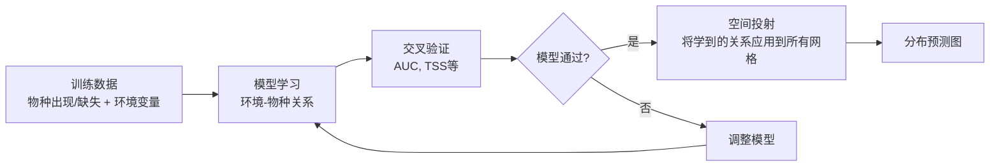

# SDM 预测地图的可靠性验证：综合分析（更新版）

> 本文档是对SDM预测地图可靠性验证的综合分析，整合了6篇参考SDM论文的验证策略。
> 完整版详见 artifact: `sdm_validation_comprehensive.md`

## 核心问题

> **模型通过了评估指标后，生成的物种分布热力图是否就自动"正确"？**

简短回答：**不是的**。但整个SDM领域确实存在一种"隐含假设"——如果模型在独立测试集上表现良好（特别是使用spatial block CV），那么它在空间上的预测应该是合理的。这个假设有其理论基础，但也有明显的局限性。

---

## 1. SDM预测地图的理论基础

### 1.1 生态位理论 (Niche Theory)

SDM的核心理论是 **Hutchinsonian niche theory**：
- 物种的分布由其对环境条件的响应决定（基本生态位 → 实现生态位）
- SDM学习的是"环境条件 → 物种出现概率"的映射关系
- **将这个映射关系投射到地理空间上，就得到了分布预测图**

> [!IMPORTANT]
> SDM预测的其实不是"物种真实分布"，而是**环境适宜性 (habitat suitability)**。两者之间存在差距，因为实际分布还受到扩散限制、生物互作、历史因素等影响。

### 1.2 从模型评估到空间预测的逻辑链

**隐含假设**：如果模型在测试集上准确预测了已知点位的出现概率，那么它对未知点位的预测也应该是准确的。

### 1.3 这个假设成立的条件

| 条件 | 说明 | CAST的应对 |
|------|------|-----------|
| **环境空间覆盖** | 训练数据覆盖了预测区域的主要环境梯度 | ✅ 全域网格覆盖 |
| **空间非自相关** | 测试集与训练集在空间上独立 | ✅ Spatial split /block CV |
| **无外推** | 预测区域的环境条件在训练数据的范围内 | ⚠️ 可加MESS分析 |
| **模型可迁移性** | 学到的关系是真实的生态学过程 | ✅ DAG+ATE因果推断 |

---

## 2. 各SDM方法的验证策略对比

| 方法 | 空间验证 | 评估指标 | 预测图一致性 | 生态学验证 | 不确定性 |
|------|---------|---------|-------------|-----------|---------|
| **CISO** | Spatial block CV | AUC, MAE, Top-k | 条件预测变化 | 与已知互作比较 | ❌ |
| **GNN-SDM** | 10-fold CV | AUC,TSS,MCC,Kappa,CCR | Cosine sim, Warren's I, Pearson's r | IUCN分布对比 | ✅ 95% CI |
| **MaskSDM** | Spatial block CV (1°×1°) | AUC | 变量子集预测图 | Shapley maps+定性 | ❌ |
| **adm** | Spatial blocks | Spearman,Pearson,MAE | ❌ | PDP | ❌ |
| **RISDM** | 空间随机效应 | 贝叶斯后验 | ❌ | ❌ | ✅ 可信区间 |
| **CAST** | Spatial split | AUC, TSS | 多模型差异图 | DAG+CATE图 | ⚠️ 多run方差 |

---

## 3. 验证预测图的完整证据链

> [!TIP]
> 学术界对SDM预测图的验证，本质上是一个**多层证据链 (multiple lines of evidence)** 的过程。没有单一的检验能证明预测图是"正确"的。

### 3.1 第一层：统计验证 (Statistical Validation)

| 方法 | 说明 | CAST已有? |
|------|------|:---:|
| 空间交叉验证 | Spatial block CV，消除空间自相关 | ✅ |
| 多指标评估 | AUC + TSS + 其他 | ✅ |
| 模型比较 | 与baseline模型对比 | ✅ |
| 不确定性量化 | CV折间的方差/标准差 | ✅ |

### 3.2 第二层：预测图的内部一致性

| 方法 | 说明 | CAST已有? |
|------|------|:---:|
| 模型间对比图 | CAST vs MLP vs RF等的difference maps | ✅ (fig7) |
| 空间一致性指标 | Cosine similarity, Warren's I | ⚠️ 建议添加 |
| 空间不确定性图 | 多seed/fold预测的标准差图 | ❌ **建议优先添加** |

### 3.3 第三层：生态学合理性验证

| 方法 | 说明 | CAST已有? |
|------|------|:---:|
| **CATE图的生态学解释** | 因果效应方向是否合理 | ✅ (fig6) |
| **DAG结构合理性** | 因果边是否符合生态学预期 | ✅ |
| **与已知分布对比** | IUCN分布范围/文献记录 | ❌ Discussion中讨论 |
| **环境响应曲线** | Partial dependence plots | ⚠️ 可添加 |
| **MESS外推检测** | 标记外推区域 | ⚠️ 可添加 |

### 3.4 第四层：外部独立验证

| 方法 | 说明 | CAST已有? |
|------|------|:---:|
| **独立数据集** | 使用未参与训练的调查数据验证 | ❌ |
| **文献对比** | 与已发表的该物种分布研究对比 | ❌ Discussion中 |

---

## 4. CAST框架的核心差异化论证

### 4.1 因果推断 vs 相关性

> [!IMPORTANT]
> **CAST的核心优势：** 其他SDM学习的是环境变量与物种出现的**统计相关性**，而CAST学习的是**因果效应**。因果关系在环境条件变化时比相关性更稳定（causal transportability），这为预测图的可靠性提供了更强的理论保障。

论文Discussion中的表述：
> "Unlike correlative SDMs that map statistical associations, CAST explicitly models causal pathways through DAG structure learning and DML-based ATE estimation. Under causal assumptions (Pearl, 2009), causal relationships are invariant under distributional shifts, providing stronger theoretical support for spatial prediction transferability."

### 4.2 CATE图作为高级验证

CATE图不仅是结果展示，更是一种**验证工具**：
- 如果CATE图显示"温度对高纬度物种有负效应" → 符合生态学预期 → 增强预测可信度
- 如果CATE图显示不合理的因果方向 → 提示可能存在混杂因素 → 需要进一步调查

---

## 5. 行动建议（优先级排序）

| 优先级 | 行动 | 实现位置 |
|--------|------|---------|
| 🔴 高 | 在Discussion中论证因果推断的理论优势 | 论文 |
| 🔴 高 | 添加预测不确定性图（多seed预测的SD图） | `fig7_spatial_prediction_maps.py` |
| 🟡 中 | 添加模型间空间一致性指标 | `fig7` 或新脚本 |
| 🟡 中 | MESS环境外推检测 | 新脚本 或 `04_generate_spatial_predictions.R` |
| 🟢 低 | Partial dependence plots | 新脚本 |
| 🟢 低 | 与IUCN分布定性对比 | 论文Discussion |

---

## 6. 总结

| 问题 | 回答 |
|------|------|
| **大家都默认模型通过后分布图就正确吗？** | 大体上是的。Spatial CV + 高AUC/TSS = 可靠的预测图。但严谨的论文会补充生态学合理性分析。 |
| **理论是什么？** | 生态位理论 + 统计泛化 + 空间独立性假设。 |
| **需要用后验知识/文献来检验吗？** | **应该但不是必须的**。好的论文会在Discussion中做定性对比。 |
| **CAST够了吗？** | **够了，甚至优于大多数SDM。** 因果推断层是核心差异化优势。 |

> [!NOTE]
> CAST框架在验证层面已经**达到或超过**SDM领域的主流标准。最关键的加强是：(1) 预测不确定性可视化，(2) Discussion中的因果推断理论论证。
